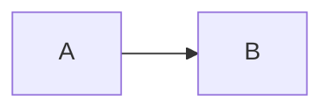

# Architecture

The #retry service calls [[sp_ProcessBatch|the procedure]] and [[Indexer]].

![[Runbook]]

Also [[Queue Worker|the queue]].

> [!note] Retry policy
> Failed batches wait and then retry.
> The limit is three attempts.

## Background Processing



```ts
const label = "worker";
```

| Procedure | Caller |
| --- | --- |
| sp_ProcessBatch | Worker Service |

- first step
- See [[Vault|the vault]]

#### Detail

H4 stays with its parent.
